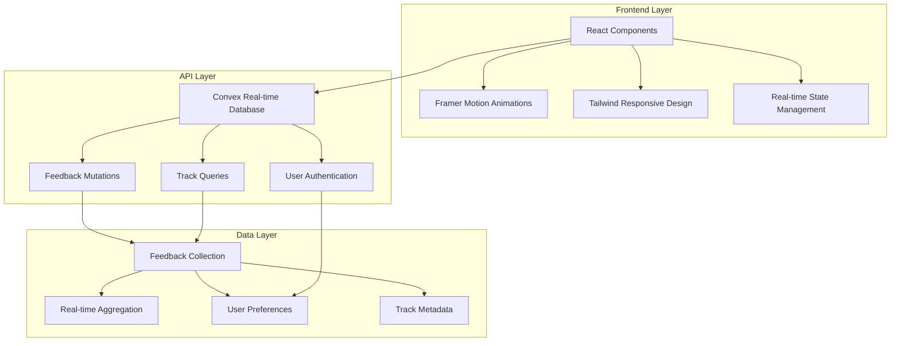
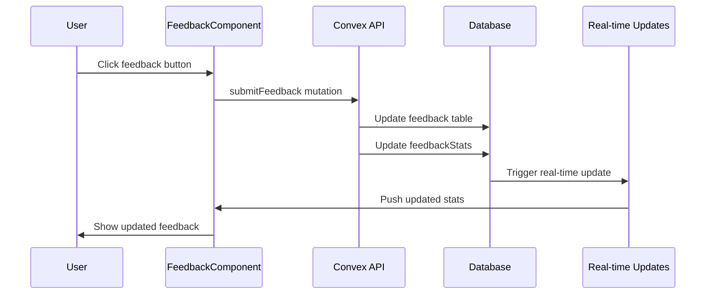

# Music Feedback Network - Design Document

## Overview

The Music Feedback Network is a minimalist social platform that enables instant, wordless feedback on music tracks through intuitive visual interactions. The design emphasizes responsive UI excellence, seamless integration with the existing music app, and scalable architecture that can grow from hundreds to millions of users while maintaining optimal performance.

## Architecture

### System Architecture Overview



### Integration Architecture

The feedback system integrates seamlessly with the existing music app through:

1. **Shared Component Library**: Reuse existing UI components (TrackCard, MusicWidget, etc.)
2. **Unified Authentication**: Leverage existing AudioProvider and user context
3. **Database Extension**: Extend current Convex schema with feedback-specific tables
4. **Responsive Design System**: Build upon existing dark theme and glass morphism

## Components and Interfaces

### Core Feedback Components

#### 1. FeedbackWidget Component
```typescript
interface FeedbackWidgetProps {
  trackId: string;
  currentFeedback?: FeedbackType;
  aggregatedStats: FeedbackStats;
  size?: 'compact' | 'default' | 'expanded';
  orientation?: 'horizontal' | 'vertical';
}
```

**Responsive Behavior:**
- **Mobile**: Vertical layout with large touch targets (44px minimum)
- **Tablet**: Horizontal layout with medium-sized controls
- **Desktop**: Compact horizontal layout with hover states

#### 2. FeedbackButton Component
```typescript
interface FeedbackButtonProps {
  type: 'love' | 'like' | 'meh' | 'dislike';
  isActive: boolean;
  count: number;
  onFeedback: (type: FeedbackType) => void;
  disabled?: boolean;
}
```

**Visual Design:**
- Emoji-based reactions with subtle animations
- Color-coded feedback types (red for love, blue for like, etc.)
- Smooth scale and glow animations on interaction
- Haptic feedback on mobile devices

#### 3. FeedbackStream Component
```typescript
interface FeedbackStreamProps {
  tracks: TrackWithFeedback[];
  sortBy: 'recent' | 'trending' | 'controversial';
  layout: 'grid' | 'list';
}
```

**Responsive Layouts:**
- **Mobile**: Single column list with swipe gestures
- **Tablet**: 2-column grid with touch-optimized spacing
- **Desktop**: 3-column grid with hover interactions

#### 4. TrendingFeed Component
```typescript
interface TrendingFeedProps {
  timeframe: '1h' | '24h' | '7d' | '30d';
  category: 'all' | 'genre-specific';
  limit: number;
}
```

### Integration Components

#### 5. Enhanced TrackCard
Extends existing TrackCard with feedback integration:
```typescript
interface EnhancedTrackCardProps extends TrackCardProps {
  showFeedback: boolean;
  feedbackStats: FeedbackStats;
  onFeedbackChange: (feedback: FeedbackType) => void;
}
```

#### 6. FeedbackMusicWidget
Extends existing MusicWidget with real-time feedback:
```typescript
interface FeedbackMusicWidgetProps extends MusicWidgetProps {
  enableFeedback: boolean;
  showLiveFeedback: boolean;
}
```

## Data Models

### Feedback Schema Extension

```typescript
// Convex Schema Extensions
export const feedbackTables = {
  feedback: defineTable({
    trackId: v.id("tracks"),
    userId: v.optional(v.id("users")), // Optional for anonymous feedback
    type: v.union(v.literal("love"), v.literal("like"), v.literal("meh"), v.literal("dislike")),
    timestamp: v.number(),
    isAnonymous: v.boolean(),
    deviceType: v.string(), // For analytics
    sessionId: v.string(), // For anonymous users
  })
    .index("by_track", ["trackId"])
    .index("by_user", ["userId"])
    .index("by_timestamp", ["timestamp"])
    .index("by_track_user", ["trackId", "userId"]),

  feedbackStats: defineTable({
    trackId: v.id("tracks"),
    loveCount: v.number(),
    likeCount: v.number(),
    mehCount: v.number(),
    dislikeCount: v.number(),
    totalFeedback: v.number(),
    averageRating: v.number(),
    lastUpdated: v.number(),
  })
    .index("by_track", ["trackId"])
    .index("by_rating", ["averageRating"])
    .index("by_total", ["totalFeedback"]),

  trendingTracks: defineTable({
    trackId: v.id("tracks"),
    score: v.number(), // Calculated trending score
    timeframe: v.string(), // "1h", "24h", "7d", "30d"
    category: v.string(),
    rank: v.number(),
    lastCalculated: v.number(),
  })
    .index("by_timeframe_rank", ["timeframe", "rank"])
    .index("by_score", ["score"]),
};
```

### Real-time Data Flow



## Error Handling

### Client-Side Error Handling

1. **Network Errors**: Graceful degradation with offline feedback caching
2. **Rate Limiting**: Visual feedback with cooldown indicators
3. **Authentication Errors**: Seamless anonymous fallback
4. **Validation Errors**: Inline error messages with recovery suggestions

### Server-Side Error Handling

1. **Database Conflicts**: Optimistic updates with conflict resolution
2. **Rate Limiting**: Per-user and per-IP rate limiting
3. **Data Validation**: Comprehensive input sanitization
4. **Performance Monitoring**: Real-time error tracking and alerting

## Testing Strategy

### Component Testing
- **Unit Tests**: Individual component behavior and props handling
- **Integration Tests**: Component interaction with Convex API
- **Visual Regression Tests**: UI consistency across devices and themes
- **Accessibility Tests**: Screen reader compatibility and keyboard navigation

### Responsive Testing
- **Device Testing**: Physical testing on iOS, Android, tablets, and desktops
- **Browser Testing**: Cross-browser compatibility (Chrome, Firefox, Safari, Edge)
- **Performance Testing**: 60fps animations and sub-500ms response times
- **Network Testing**: Offline functionality and slow connection handling

### User Experience Testing
- **Usability Testing**: Task completion rates and user satisfaction
- **A/B Testing**: Feedback mechanism effectiveness
- **Load Testing**: Performance under high concurrent usage
- **Analytics Testing**: User engagement and retention metrics

## Responsive Design System

### Breakpoint Strategy
```css
/* Mobile First Approach */
.feedback-widget {
  /* Mobile: 320px - 767px */
  display: flex;
  flex-direction: column;
  gap: 0.75rem;
  padding: 1rem;
}

@media (min-width: 768px) {
  /* Tablet: 768px - 1023px */
  .feedback-widget {
    flex-direction: row;
    gap: 1rem;
    padding: 1.5rem;
  }
}

@media (min-width: 1024px) {
  /* Desktop: 1024px+ */
  .feedback-widget {
    gap: 1.25rem;
    padding: 2rem;
  }
}
```

### Touch Target Optimization
- **Minimum Size**: 44px x 44px for all interactive elements
- **Spacing**: 8px minimum between touch targets
- **Feedback**: Immediate visual and haptic feedback on interaction
- **Gestures**: Swipe support for mobile feedback navigation

### Animation Performance
- **GPU Acceleration**: Transform and opacity animations only
- **Reduced Motion**: Respect user's motion preferences
- **Frame Rate**: Maintain 60fps on all devices
- **Battery Optimization**: Pause animations when not visible

## Scalability Considerations

### Database Optimization
- **Indexing Strategy**: Optimized indexes for common query patterns
- **Aggregation**: Pre-calculated statistics for trending algorithms
- **Caching**: Redis-like caching for frequently accessed data
- **Sharding**: Horizontal scaling strategy for millions of users

### Performance Optimization
- **Code Splitting**: Lazy loading of feedback components
- **Bundle Optimization**: Tree shaking and minimal bundle sizes
- **CDN Strategy**: Global content delivery for static assets
- **Real-time Optimization**: Efficient WebSocket connection management

### Monitoring and Analytics
- **Performance Metrics**: Real-time monitoring of response times
- **User Analytics**: Engagement patterns and feature usage
- **Error Tracking**: Comprehensive error logging and alerting
- **Capacity Planning**: Predictive scaling based on usage patterns